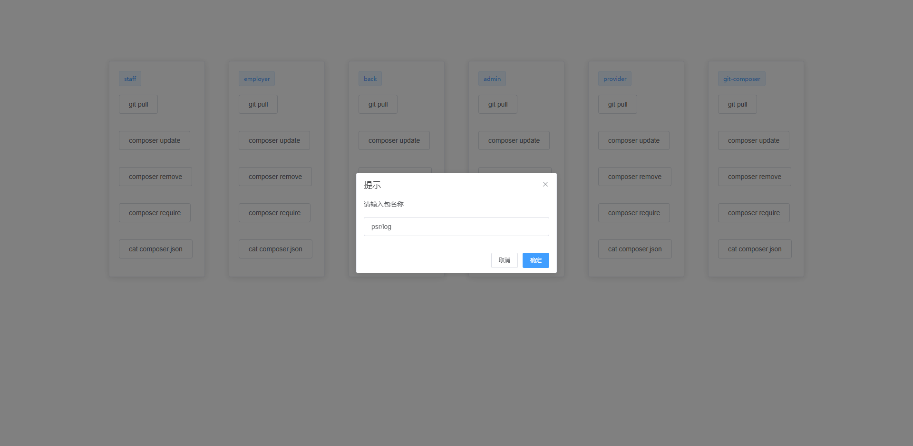
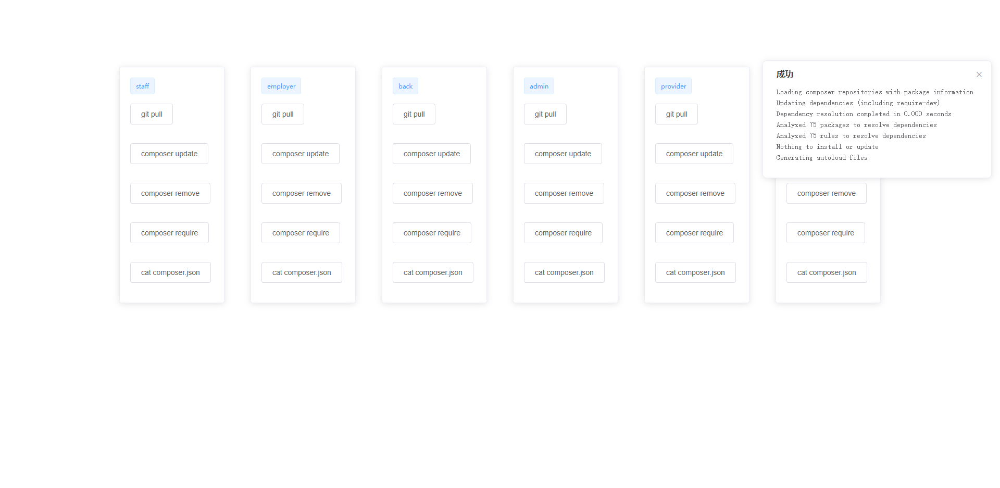

# git-composer

php+vue+element ui实现代码同步工具 远程包管理工具

>说明：在服务器上开发项目，我们经常需要到服务器手动拉代码，composer管理依赖包。该工具实现远程项目git pull,依赖包管理
### 代码托管
| 名称   | 地址                                       |
| ------ | ----------------------------------------- |
| github |https://github.com/cqxiaomi/git-composer.git|
| gitee  |https://gitee.com/cqxiaomi/git-composer.git |

---

#  安装
## 修改配置参数

> 通常根据自己部署的实际环境，修改参数。

`app\configs\Produce.php`，修改 Produce.php 中的如下参数

```
        /*################ TOKEN CONFIG ##################*/
        'COMPOSER' => [
            'bin' => '/usr/bin/composer' //在linux环境composer位置 可以通过whereis composer查询  
        ],
        /*################ USERS CONFIG ##################*/
        'USERS'    => [
            'admin' => 'admin', // 账号/密码,
            'test'  =>  '123456', // 账号/密码,
        ],
        /*################ PROJECTS CONFIG ##################*/
        'PROJECTS' => [
            'shop'         => '/data/www/shop.test.com', // 项目名称/项目路径,
            'app'          => '/data/www/app.test.com',
            'back'         => '/data/www/back.test.com',
            'admin'        => '/data/www/admin.test.com',
            'git-composer' => '/mnt/hgfs/demo/git-composer'
        ],
```
> 开放php.ini disable_functions和开启GIT的免密pull

- 修改 php.ini
  + 打开禁用函数列表（php.ini） /usr/local/php/etc/php.ini
  + disable_functions = proc_open,proc_get_status, popen, exec, system, shell_exec, passthru
  + 这里要把 proc_open,proc_get_status 去掉
  + 重启php
  + ```bash
    $ service php-fpm restart 
    ```
- 开启git免密pull (http方式)
   + 创建文件.git-credentials
   + ```bash
       $ cd ~
       $ touch .git-credentials
       $ vim .git-credentials
       $ 添加内容 http://账号:密码@github.com 后保存
     ```
   + 设置配置
   + ```bash
       $ git config --global credential.helper store 
     ```
>说明：git免密pull 也可以通过SSH方式实现,具体移步谷歌/百度

## 安装 
- 端口可以自定义
```bash
$ php -S 0.0.0.0:8888 index.php 
```
##### 后台运行
```bash
$ nohup php -S 0.0.0.0:8888 index.php &
```
# 功能列表

- [x] composer require -- 完成
- [x] composer update -- 完成
- [x] composer remove -- 完成
- [x] cat composer.json -- 完成
- [x] git pull -- 完成

# 效果图



# 效果演示

#### (账号:admin 密码:admin)

[查看效果请戳这里](http://106.12.178.138:1008/)

*如有问题请直接在 Issues 中提，或者您发现问题并有非常好的解决方案，欢迎 PR 👍*

*你们的star是我的动力*
